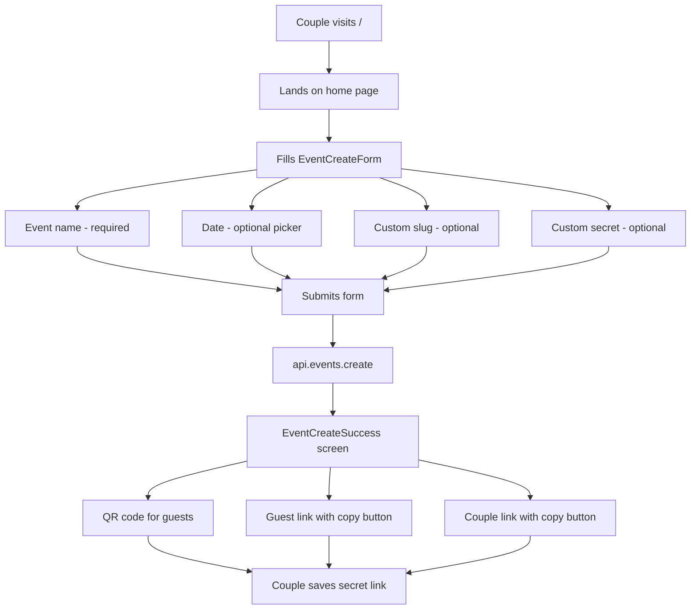
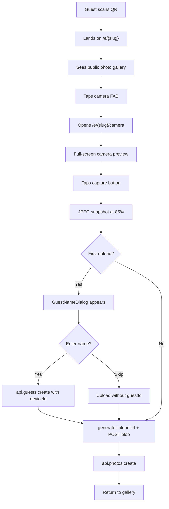
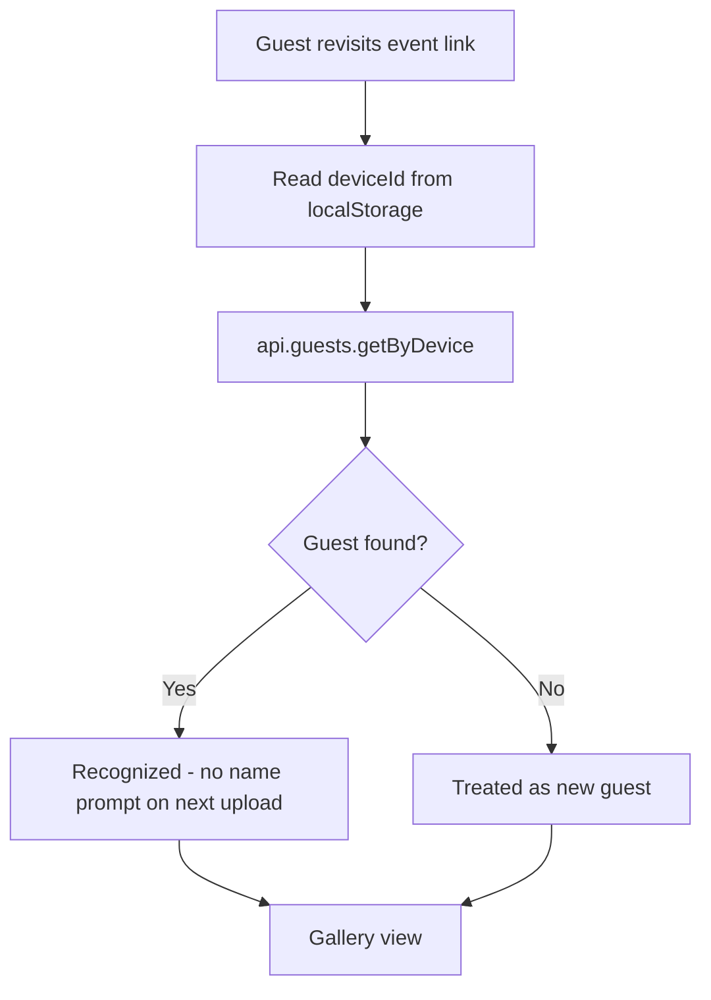
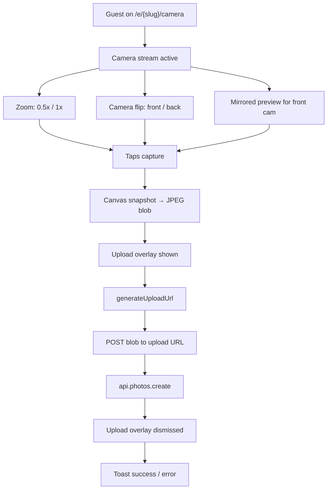
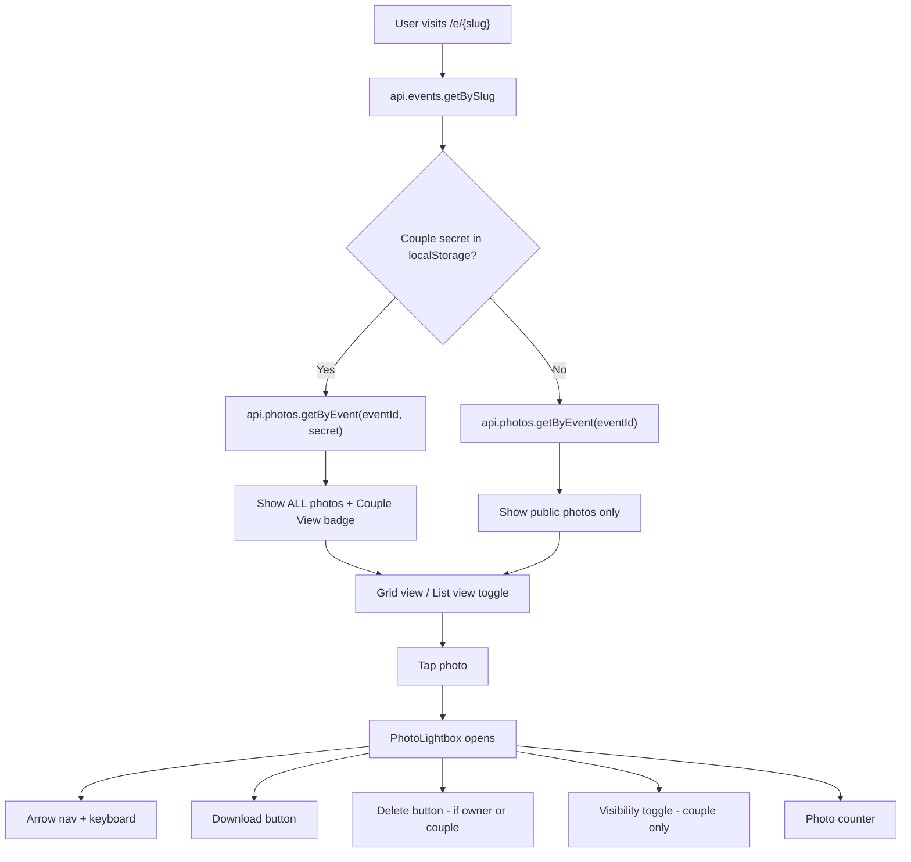
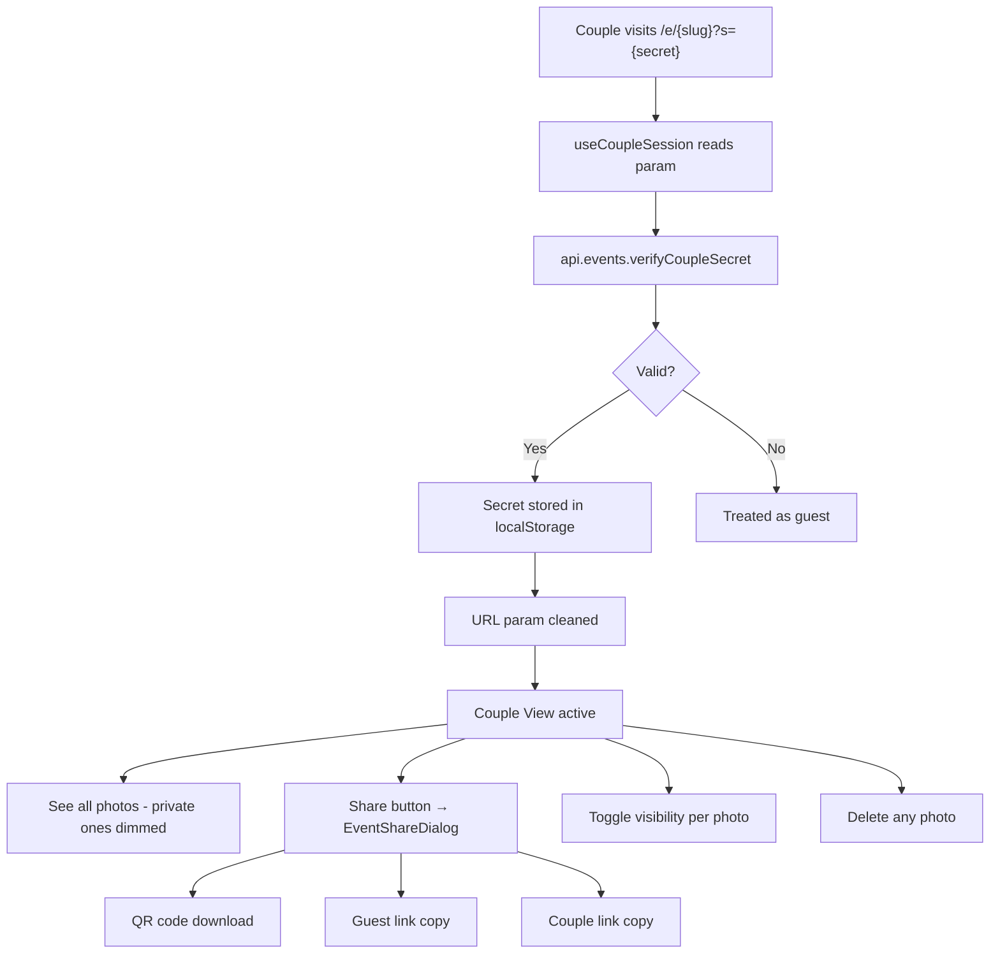
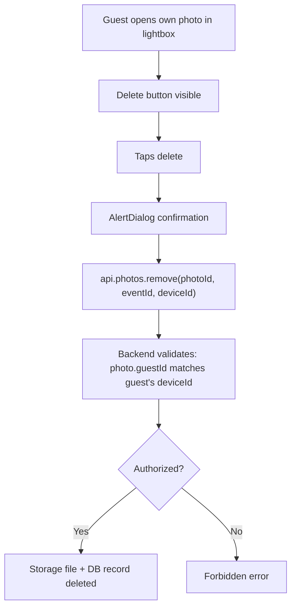
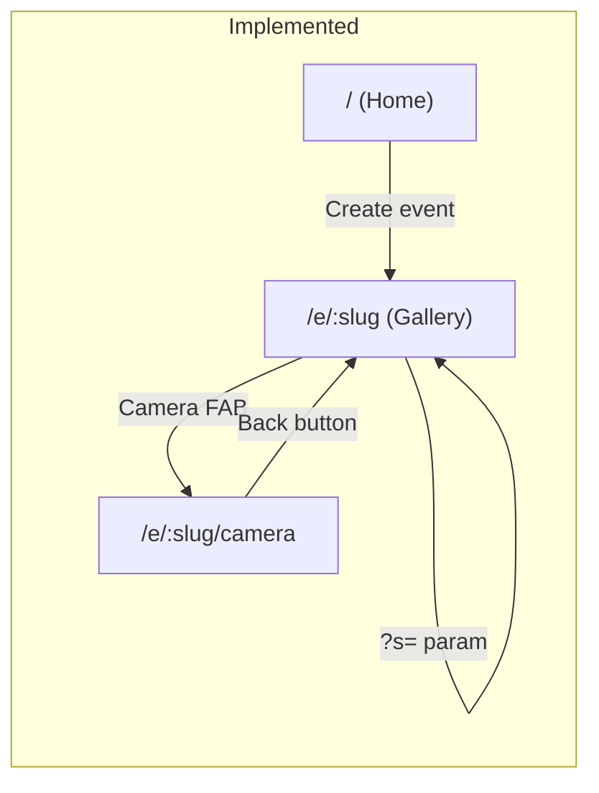
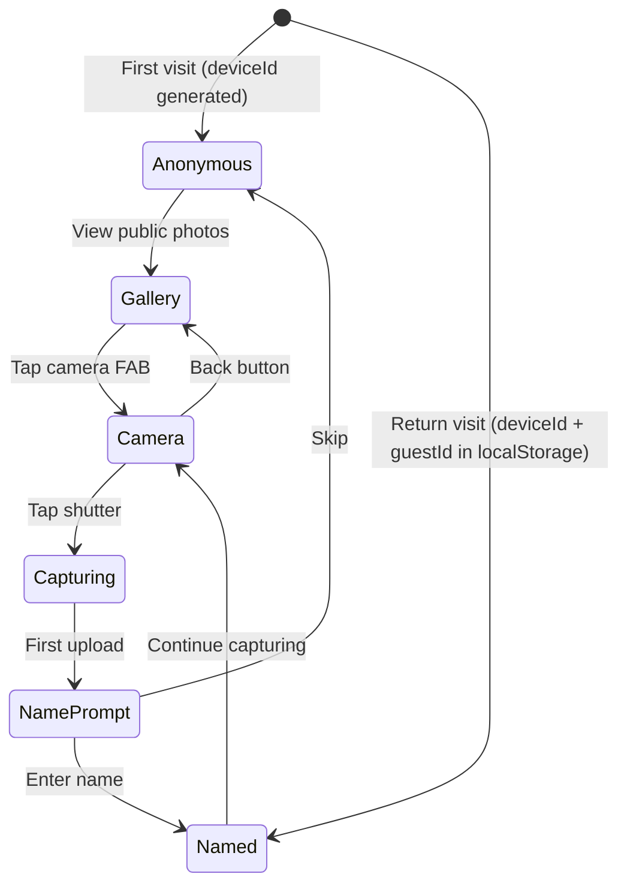

# User Flows

All user flows for the wedding photo sharing app. Updated to reflect current implementation.

## 1. Couple Creates Event

## 2. Guest First Visit + Photo Capture

## 3. Returning Guest

## 4. Photo Capture & Upload

> **Note:** Offline queue is designed ([ADR 002](decisions/002-offline-queue.md)) but not yet implemented. Currently uploads fail silently if offline.

## 5. Browse Gallery

## 6. Couple Manages Photos

## 7. Guest Deletes Own Photo

## Page Map

## Guest Session States

## Summary

| Flow | Status | Actors | Trigger | End State |
|------|--------|--------|---------|-----------|
| Create event | Done | Anyone | Visit home, fill form | Event exists, QR + links ready |
| Join event | Done | Guest | Scan QR / visit link | Gallery visible, camera accessible |
| Capture photo | Done | Guest | Tap capture on camera screen | Photo uploaded to gallery |
| Guest name | Done | Guest | First upload triggers dialog | Guest record created (or skipped) |
| Browse gallery | Done | All | Visit event page | Grid/list view with lightbox |
| Couple auth | Done | Couple | Visit with `?s=` param | All photos visible, management controls |
| Toggle visibility | Done | Couple | Tap toggle in lightbox | Photo public/private flipped |
| Delete photo | Done | Couple / Guest (own) | Tap delete in lightbox | Photo removed from storage + DB |
| Share event | Done | Couple | Tap share button | Dialog with QR, guest link, couple link |
| Offline queue | Not built | System | — | See [ADR 002](decisions/002-offline-queue.md) |
