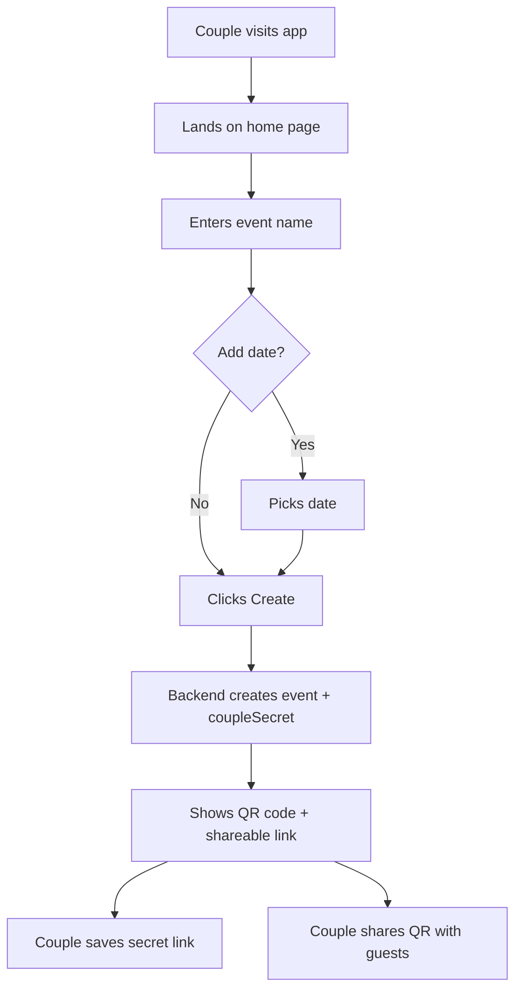
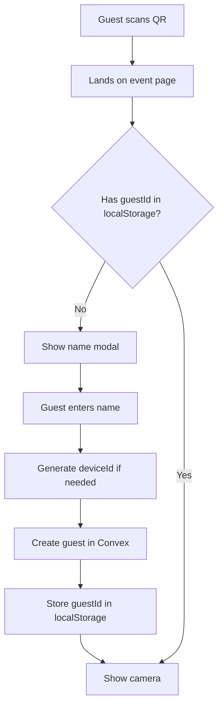
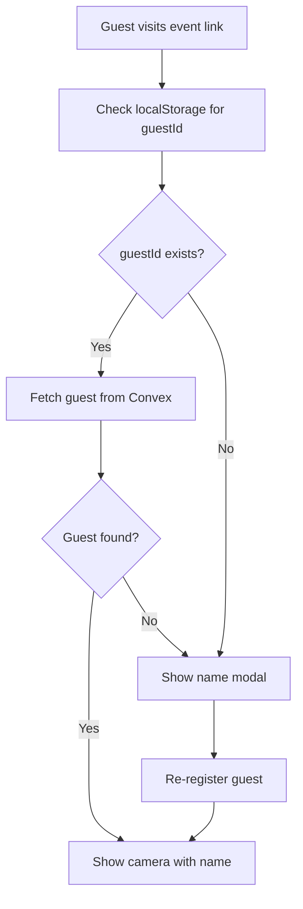
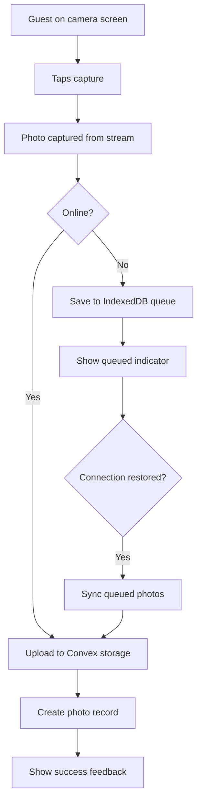
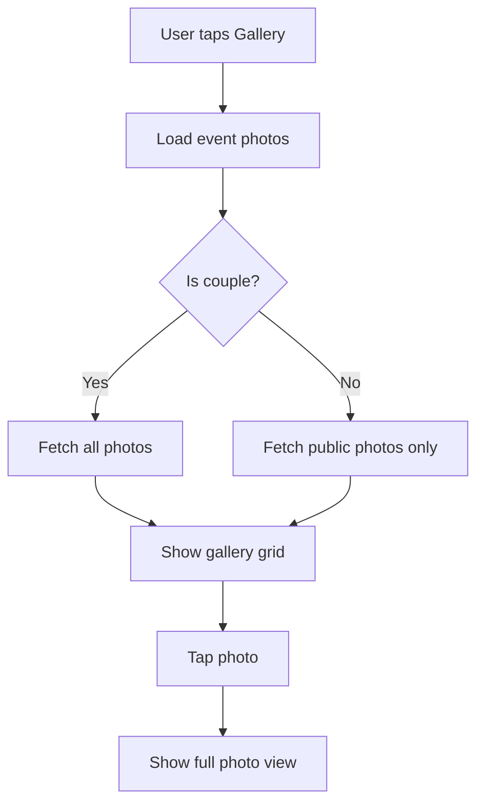
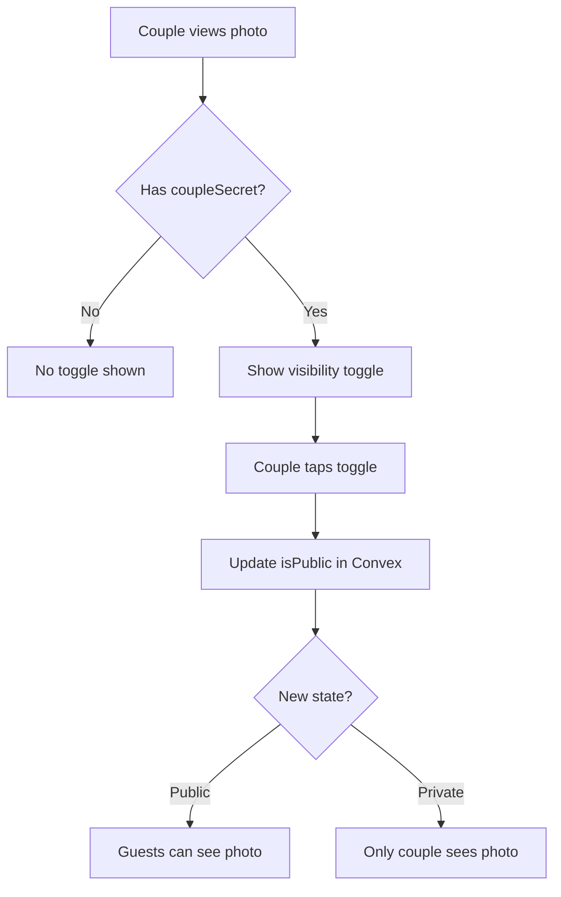
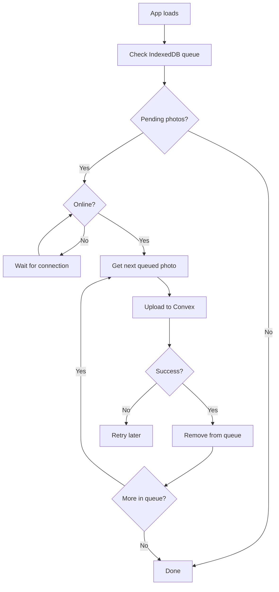
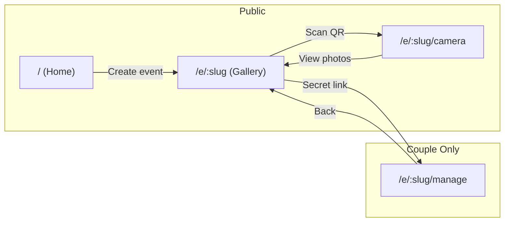
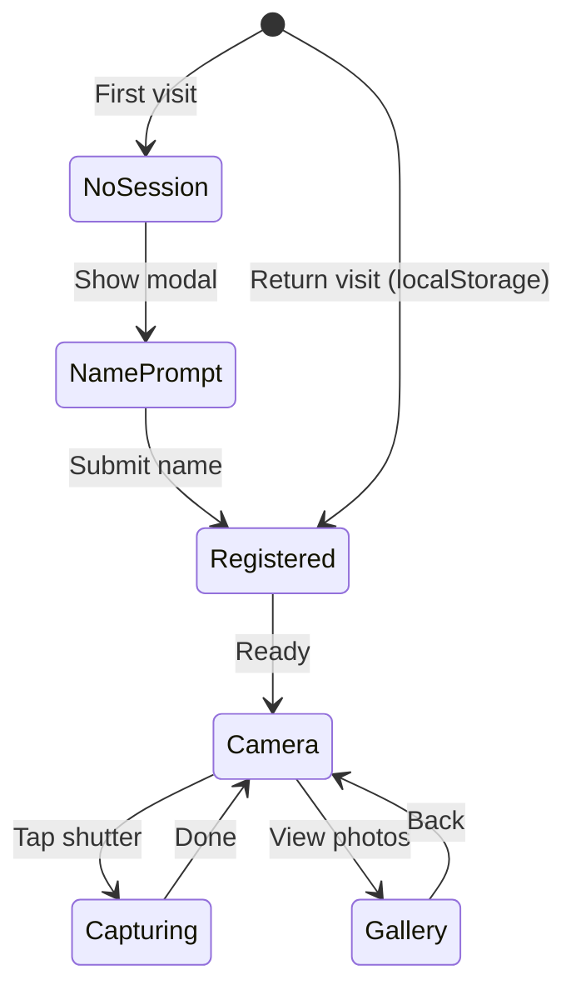

# User Flows

All user flows for the wedding photo sharing app.

## 1. Couple Creates Event

## 2. Guest First Visit

## 3. Guest Returns

## 4. Photo Capture & Upload

## 5. View Gallery

## 6. Toggle Photo Visibility (Couple Only)

## 7. Offline Queue Sync

## Page Map

## Guest Session States

## Summary

| Flow | Actors | Trigger | End State |
|------|--------|---------|-----------|
| Create event | Couple | Visit home, fill form | Event exists, QR ready |
| Join event | Guest | Scan QR | Guest registered, camera ready |
| Capture photo | Guest | Tap shutter | Photo in gallery (or queue) |
| View gallery | All | Tap gallery | See photos |
| Toggle visibility | Couple | Tap toggle | Photo public/private |
| Sync queue | System | Connection restored | Queued photos uploaded |
